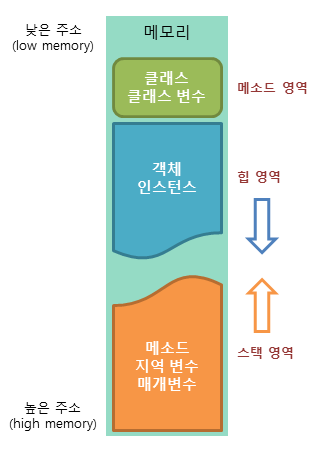

4.4 Bit 수업 14일차
===================
# Thread 제어의 대한 문제점
## Thread 의 우선순위
### 일정한 시간을 나눠서 실행
### 확률의 정확도는 표본집단이 많아야 함
### 스레드 종료
### 코드적으로 구현
### 메인이 끝나도 스레드는 백그라운드에서 계속 돌아감
### sleep은 시간되면 무조건 탈출하는 시스템이라면(시간되면 main실행)
### join은 시간 이내에 끝나면 바로 끝남
## 데몬쓰레드
 

## 대부분 SI 는 기술면접 구두로 진행
 

## 메모리 영역

### 클래스 영역 - 모든것들을 올려놓는 영역
### 스택 영역 - (코드의 진행)일을 수행하는 위치, 자료구조의 스택구조로 업무수행
### 힙 영역 - 객체를 찍어내는 영역
 

## 키
### notify, wait
 

# ip
## ipv4 address

## 공인아이피
### 찾아가기 위한 ip 중복 x

## 사설아이피
### 외부에서 접근할 수 없는 ip, 중복허용
### 통신은 해야되니까 통신하기 위해 존재하는 ip로 일반적으로 요청해서 나가는 ip

## 공인아이피와 사설아이피의 차이점

### ====================================================

## 고정아이피
### 변경되지 않는 공인 ip , 고정되어있는 ip

## 유동아이피
### ip번호가 상시적으로 바뀔수 있음.
### ip를 자동적으로 할당 받음

## 고정아이피와 유동아이피의 차이점
### ddd
 

# 서버
## 서버의 주소
 

### 어디로 가야할지는 ip주소가 필요함
 

### DHCP

# 네트워크 7계층

### 1~2 계층 -> PHYSICAL
### 3~4 계층 -> OS 3->ip 4->port 
### 5~7 계층 -> APP

## dns 차이
### https://unicorn-adblock.zendesk.com/hc/ko/articles/900001029663-1-1-1-1-8-8-8-8-%EC%8B%9C%EC%8A%A4%ED%85%9C-DNS-%EC%B0%A8%EC%9D%B4%EA%B0%80-%EA%B6%81%EA%B8%88%ED%95%B4%EC%9A%94

## 웹
### 브라우저에서 해석되는 언어가 프론트
### 움직임을 주는것도 프론트 언어
### 서버측에서 구동되는 언어가 백엔드

### 함부로 크롤링 하면 불법 조심

### 내일 할것
### TCP <--> UDP
### 채팅프로그램 만들예정 쉐엣
### 평가 진행할텐데 주제는 io와 thread