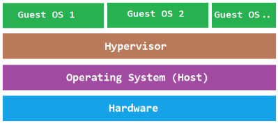

4.7 Bit 수업 17일차
======================

 

 

 

## 리눅스
## 명령어
## 현재경로확인 
### 리눅스 -> pwd
### 윈도우 -> cd
 

## 디렉토리확인
### 리눅스 -> ls
### ls -l 입력시 윈도우 dir처럼 자세히 출력
### 윈도우 -> dir
### dir /w 입력시 리눅스 ls처럼 간단히 출력
 

## 디렉토리 위치변경
### 리눅스 -> cd - 명령어
### 윈도우 -> cd - 명령어

### 리눅스 아무말 없으면 정상작동

### ~ 은 home디렉토리를 뜻함
### 아무장치 없이 서로 의사소통 X

### 리눅스에서 확장자는 사용자를 위한것(구분하기 위해)