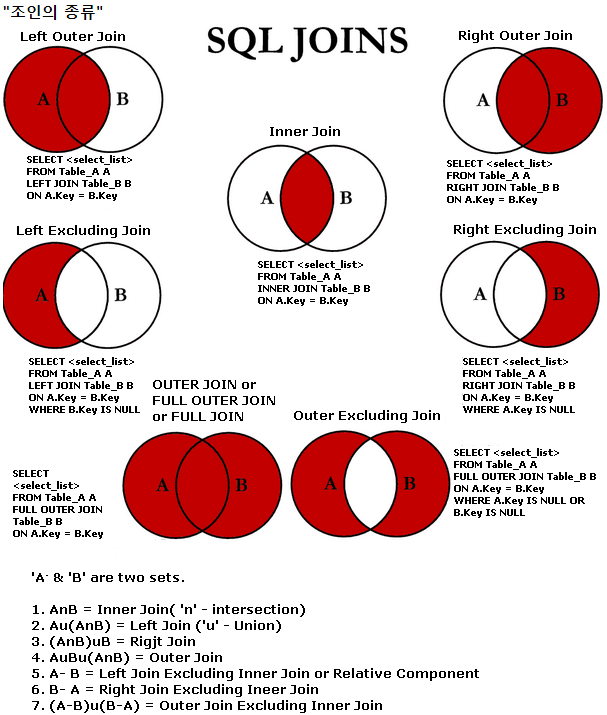

4.15 Bit 수업 23일차
====================
## TEST
### 데이터 베이스 서버구축과 웹서비스 서버를 구축하려고 한다. 
### 하이퍼바이저 서비스인 vagrant를 통해 mysql서버와 tomcat서버를 각각 설정하시오
### vgrantfile 내용 수정해서 vagrant up 명령어 하나로 자동으로 가능하게 하는 것
<br>

## DB service
```
Vagrant.configure("2") do |config|
  config.vm.box = "generic/centos8"
  config.vm.network "forwarded_port", guest: 3306, host: 33066
  # config.vm.synced_folder "../data", "/vagrant_data"

  config.vm.provision "shell", inline: <<-SHELL
	dnf install -y mysql-server.x86_64	
	firewall-cmd --add-port=3306/tcp --permanent
	firewall-cmd --reload
	systemctl start mysqld
	touch root.sql
	echo "create user 'root'@'%' identified by '1234';" > root.sql
	echo "grant all privileges on *.* to 'root'@'%' with grant option;" >> root.sql
	echo "flush privileges;" >> root.sql
	mysql -u root < root.sql
  SHELL
end
```
<br>

## Tomcat Server
```
Vagrant.configure("2") do |config|
  config.vm.box = "generic/centos8"
  config.vm.network "forwarded_port", guest: 8080, host: 18080
  # config.vm.synced_folder "../data", "/vagrant_data"

  config.vm.provision "shell", inline: <<-SHELL
	dnf install -y java-1.8.0-openjdk-devel.x86_64
	echo 'JAVA_HOME=/usr/lib/jvm/java-1.8.0-openjdk-1.8.0.312.b07-2.el8_5.x86_64' >> /etc/profile
	echo 'PATH=$JAVA_HOME:$PATH' >> /etc/profile
	wget https://archive.apache.org/dist/tomcat/tomcat-7/v7.0.109/bin/apache-tomcat-7.0.109.tar.gz
	tar -zxvf apache-tomcat-7.0.109.tar.gz
	wget -P apache-tomcat-7.0.109/lib https://repo1.maven.org/maven2/mysql/mysql-connector-java/8.0.28/mysql-connector-java-8.0.28.jar
	firewall-cmd --add-port=8080/tcp --permanent
	firewall-cmd --reload
	./apache-tomcat-7.0.109/bin/startup.sh
	mkdir apache-tomcat-7.0.109/webapps/test
	echo '<h1>connection: <%
		String driver="com.mysql.cj.jdbc.Driver";
		String url="jdbc:mysql://192.168.128.143:33066/mysql";
		String user="root";
		String password="1234";
		Class.forName(driver);
		java.sql.Connection conn=null;
		conn=java.sql.DriverManager.getConnection(url,user,password);
		out.print(conn!=null);
		if(conn!=null)conn.close();
	%> </h1>' > apache-tomcat-7.0.109/webapps/test/index.jsp
  SHELL
end
```
<br>
<br>

## DB

## JOIN



### [출처1](https://pearlluck.tistory.com/46)
### [출처2](https://m.blog.naver.com/PostView.naver?isHttpsRedirect=true&blogId=gksshdk8003&logNo=220723307634)
<br>

## 에시 sql
```
use scott;
### ORACLE 표준
select count(*) from emp;
select count(*) from dept;
delete from dept where deptno>40;
select 14*4;
select count(*) from emp,dept;
### cross join
select count(*) from emp A,dept B where A.deptno=B.deptno;
select A.empno,A.ename,A.deptno,B.deptno,B.dname,B.loc from emp A,dept B;
### equi join
select A.empno,A.ename,A.deptno,B.deptno,B.dname,B.loc from emp A,dept B
where A.deptno=B.deptno;
### non-equi join
select A.empno,A.ename,A.deptno,B.deptno,B.dname,B.loc from emp A,dept B
where A.deptno!=B.deptno;
### outer join
select A.empno,A.ename,A.deptno,B.deptno,B.dname,B.loc from emp A,dept B
where A.deptno=B.deptno;

-- select A.empno,A.ename,A.deptno,B.deptno,B.dname,B.loc from emp A,dept B
-- where B.deptno=A.deptno(+);

### ANSI
select * from emp cross join dept;
-- join의 조건
select * from emp inner join dept on emp.deptno=dept.deptno
where emp.deptno=10;
select * from emp inner join dept using (deptno);
select * from emp natural join dept;
select *from emp right outer join dept on emp.deptno=dept.deptno;
select *from emp right outer join dept using (deptno);
select * from dept left outer join emp using (deptno);

select * from emp full join dept using(deptno);

select * from dept left outer join emp on emp.deptno=dept.deptno
where emp.ename is null;

### self join
select * from emp;

select * from emp A, emp B where A.mgr=B.empno;

select A.empno,A.ename,A.mgr,B.empno,B.ename,B.mgr 
from emp A, emp B where A.mgr=B.empno;

-- self join도 결과적으로 봤을땐 inner join
select A.empno,A.ename,A.mgr,B.empno,B.ename,B.mgr 
from emp A inner join emp B on A.mgr=B.empno;
```
<br>

## 서브쿼리

## 예시 sql
<br>

```
-- 서브쿼리의 특징 조인으로 할수 있는것을 서브쿼리로도 할수있음(100%는 아님)
-- 성능적으로 조인보다 부담이 덜되므로 빠름
-- 안쪽에 있는 서브쿼리문이 먼저 실행되고 그 이후에 밖에 있는게 실행됨
-- 다양한 위치에 가능(컬럼,테이블 등등..)
select ename,(select ename from emp B where A.mgr=B.empno) 
from emp A;
-- 이처럼 테이블 자리 가능
select * from (select * from dept) A;
-- 조건문에도 올수는 있음
select * from dept where deptno=(select deptno from dept where deptno=10);

-- 필드명 자리에 왔을 때
select dname,(select loc from dept where deptno=10) from dept;
-- 하나의 레코드만 와야하고 여러개의 레코드가 오면 안됨
select dname,'문자열' from dept;

-- 테이블 자리에 왔을때
-- 자유로움 다됨
-- 레코드가 여러개면 결과를 보고 하나의 테이블로 나오기 때문에 밑에는 deptno가 없기 때문에 에러남
select loc,dname,deptno from (select loc,dname from dept) A;
select * from (select loc,dname from dept) A;

-- 조건자리
-- 필드자리에 오는것과 동일함, 하나의 값만 와야하고 하나의 레코드만 와야함
select * from dept 
where deptno=(select deptno from dept where deptno=10);
-- 여러개의 레코드값이 결과로 나오지만 in이라서 가능
select * from dept 
where deptno in (select deptno from dept);
-- (select deptno from dept) != (select 10,20,30,40 from dual)
-- (select deptno from dept) 세로로 나옴
-- (select 10,20,30,40 from dual) 가로로 나옴

create table dept2(
	deptno int primary key,
    dname varchar(45),
    loc varchar(45)
);
-- dept 값이 dept2에 들어감, 복사됨
insert into dept2 (select * from dept);
select * from dept2;
select * from dept;
-- dept 결과값이 들어가므로 제약조건에 대해서는 복사가 안됨
create table dept3 as (select * from dept);
select * from dept3;

-- where 말도 안되는 조건이라 내용은 없지만 스키마는 정의되어있음, 즉 스키마만 복사함
create table dept4 as (select * from dept where 0=1);
select * from dept4;
```
<br>

### [출처3](https://mozi.tistory.com/233)