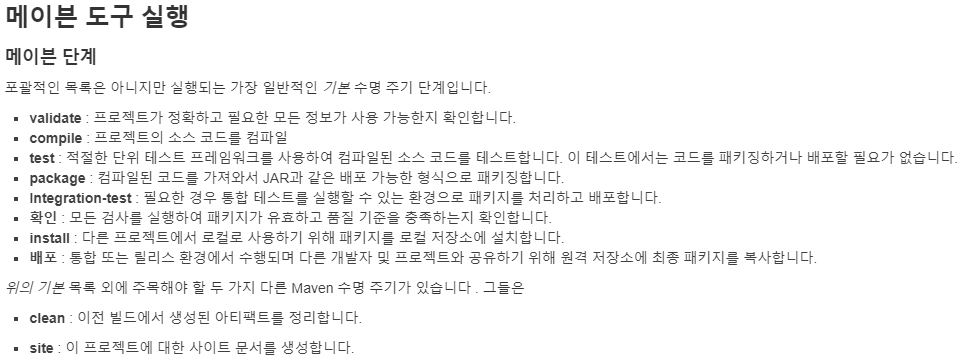

4.21 Bit 수업 27일차
===================
## 오전
## git
## [gitignore 만드는 사이트](https://www.toptal.com/developers/gitignore/)
### 이클립스 툴 자체에 내장되어있는 git은 사용하지 말것 (충돌남)
<br>

## Maven
### 알아서 필요한 라이브러리들도 같이 설치해줌
### 필요한 라이브러리를 넣으면 의존적인 것들은 알아서 잘 해결해줌(요즘에나)
### 일일히 명세를 안해도 자동으로 등록해줌

### ant를 포함하고 있음
### ant를 명령어로 가공해놓은것이 maven!
<br>

```
jar cvf '이름'.war .
```
### Maven 형태로 바꿔주는 명령어
### snapshot(베타버전같은 느낌, 잠깐 찍어논거), releases (배포용도)

<br>

### 
### verify -> 확인
### deploy -> 배포
<br>

## 점심
### 국민취업지원제도 상담
<br>

## 오후
## trim() 함수
## [도움-trim() 함수](https://support.microsoft.com/ko-kr/office/trim-%ED%95%A8%EC%88%98-410388fa-c5df-49c6-b16c-9e5630b479f9)
<br>

## updateOne
## [도움-updateOne](https://www.mongodb.com/docs/drivers/java/sync/current/usage-examples/updateOne/)
<br>

## limt()
## find().limt(?) ? 만큼 갯수 제한